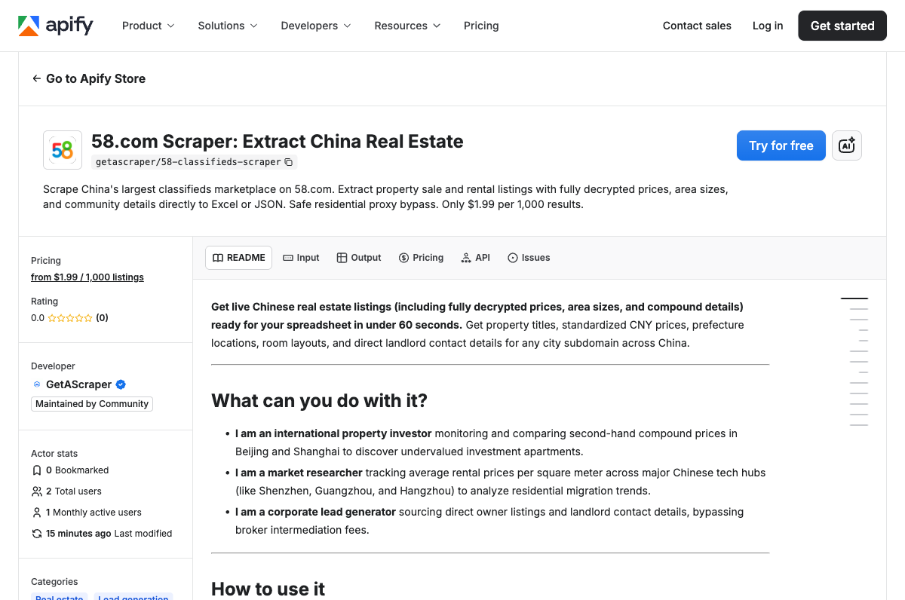

<h1 align="center">58.com Scraper | China Real Estate | Apify Actor</h1>

<p align="center">
  <a href="https://apify.com/getascraper/58-classifieds-scraper"></a>
  <a href="https://github.com/getascraper/how-to-scrape-58-classifieds"></a>
  <a href="https://github.com/getascraper/how-to-scrape-58-classifieds"></a>
  <a href="https://github.com/getascraper/how-to-scrape-58-classifieds"></a>
  <a href="https://apify.com/getascraper/58-classifieds-scraper"></a>
</p>

<p align="center">
  <strong>58.com scraper and Chinese real estate data extraction API.</strong> Extract property sale and rental listings with compound names, CNY prices, room layouts, and location details from 58.com with this Apify Actor. Playwright browser automation with font decoding and CAPTCHA solving. Free tier included.
</p>

<p align="center">
  <strong>Price: $1.99 per 1,000 results</strong>
</p>

<p align="center">
  
</p>

## What does 58.com Scraper do?

The **58.com Scraper** extracts property listings from **58.com**, China's largest classifieds hub. It covers both major real estate categories:
- **Ershoufang (二手房)** - For-sale properties
- **Chuzu (租房)** - Rental properties

It extracts:
- **CNY prices** (normalized from 万 or 元/月 text to numeric values)
- **Compound names** and **room layouts** (e.g., 3室2厅)
- **Area sizes** in square meters
- **City, district, and neighborhood**
- **Seller profiles** (private landlord or professional agency)
- **Font decoding** for obfuscated numbers
- **CAPTCHA solving** for sliding puzzles

## Why use 58.com Scraper?

- **Property Investment:** Monitor and compare second-hand compound prices in Beijing and Shanghai to discover undervalued investment apartments.
- **Market Research:** Track average rental prices per square meter across major Chinese tech hubs to analyze residential migration trends.
- **Lead Generation:** Source direct owner listings and landlord contact details, bypassing broker intermediation fees.

## How to use 58.com Scraper

1. Create a free Apify account.
2. Open the **58.com Scraper** in the Apify Store.
3. Select your target city (e.g., Beijing, Shanghai) and category (For-Sale or Rentals).
4. Enter an optional keyword (e.g., district name, compound name, or subway).
5. Click **Start** and download the dataset as JSON, CSV, or Excel.

## Input Parameters

| Field | Default | Description |
| city | bj | Target city subdomain (Beijing bj, Shanghai sh, Shenzhen sz, Guangzhou gz). |
| category | ershoufang | Vertical category: ershoufang (For-Sale) or chuzu (Rentals). |
| keyword | "" | Optional keyword in Chinese (e.g., compound name, layout). |
| maxItems | 100 | Maximum number of classified listings to extract. |
| onlyLandlord | false | Filter out real estate brokers and list direct owners only. |
| decryptNumbers | true | Download and decode dynamic .woff obfuscated web fonts. |
| solveCaptcha | true | Solve sliding CAPTCHAs locally using template-matching. |

## Output Structure

```json
{
  "id": "578414171",
  "url": "https://bj.58.com/ershoufang/578414171x.shtml",
  "title": "望京西园 经典三居室 南北通透",
  "description": "房源真实有效，户型方正，南北通透，采光好...",
  "price": 4800000,
  "priceRaw": "480万",
  "currency": "CNY",
  "city": "北京",
  "district": "朝阳",
  "neighborhood": "望京",
  "compoundName": "望京西园",
  "layout": "3室2厅1卫",
  "area": 96.38,
  "areaRaw": "96.38㎡",
  "sellerType": "PRIVATE",
  "sellerName": "张先生",
  "scrapedAt": "2026-06-10T13:00:00.000Z"
}
```

## Output Fields

| Field | Description |
| id | Unique identifier of the property ad. |
| url | Canonical direct property link. |
| title | Title of the listing. |
| price | Standardized price value in Yuan (CNY). |
| priceRaw | Raw price string as displayed (e.g., 480万 or 3200元/月). |
| compoundName | Name of the residential compound or community. |
| layout | Apartment room layout configuration (e.g., 3室2厅). |
| area | Standardized floor area size in square meters. |
| sellerType | Type of seller (PRIVATE landlord or PROFESSIONAL agency). |
| sellerName | Name of the seller or listing broker. |
| scrapedAt | ISO timestamp of when the listing was saved. |

## Cost

Pricing is pay-per-result. Empty runs cost nothing.

- **Rate: $1.99 per 1,000 results** ($0.00199 per result).
- 100 listings typically cost $0.20.
- 1,000 listings cost exactly $1.99.
- 10,000 listings cost exactly $19.90.

## Tips

- **Decrypted Price and Area Values.** 58.com obfuscates numbers using dynamic web fonts. The Actor automatically parses styles, downloads the .woff font file, and decodes Unicode glyphs back to readable digits.
- **Local Sliding-CAPTCHA Solver.** When 58.com serves a sliding puzzle, the Actor triggers a native curve-matching algorithm to resolve it locally without paid solvers.
- **Bypass Chinese Geoblocks.** 58.com applies aggressive geoblocks to traffic outside mainland China. Use premium rotating residential proxies for unblocked execution.

## FAQ

**Does it get blocked by 58.com?**
No. The scraper routes through premium, rotating residential proxies, making traffic appear identical to regular domestic Chinese users.

**Does it extract private phone numbers?**
No. 58.com protects phone numbers behind click-walls and SMS verification. The scraper retrieves full seller names, compound names, and listing details instead.

**How fresh is the data?**
Extremely fresh. Live browser rendering on every query retrieves the latest properties posted on 58.com in real-time.

**Are all categories supported?**
Yes. Both major real estate categories: ershoufang (For-Sale) and chuzu (Rentals).

## Related scraping tools

- [Zhaopin Scraper](https://github.com/getascraper/how-to-scrape-zhaopin) - Chinese jobs with CNY salaries and geolocations
- [Lagou Scraper](https://github.com/getascraper/how-to-scrape-lagou) - Chinese tech jobs with monthly salaries
- [Liepin Scraper](https://github.com/getascraper/how-to-scrape-liepin) - Chinese white-collar jobs with bonus months
- [Milanuncios Scraper](https://github.com/getascraper/how-to-scrape-milanuncios) - Spanish classifieds with EUR prices
- [Mercari Japan Scraper](https://github.com/getascraper/how-to-scrape-mercari-japan) - Japanese second-hand marketplace

## Support

- Open an issue at https://github.com/getascraper/how-to-scrape-58-classifieds/issues
- Contact us through the Apify Console

---

*Built with the Apify SDK and Playwright. Optimized for Chinese real estate data extraction at scale.*
